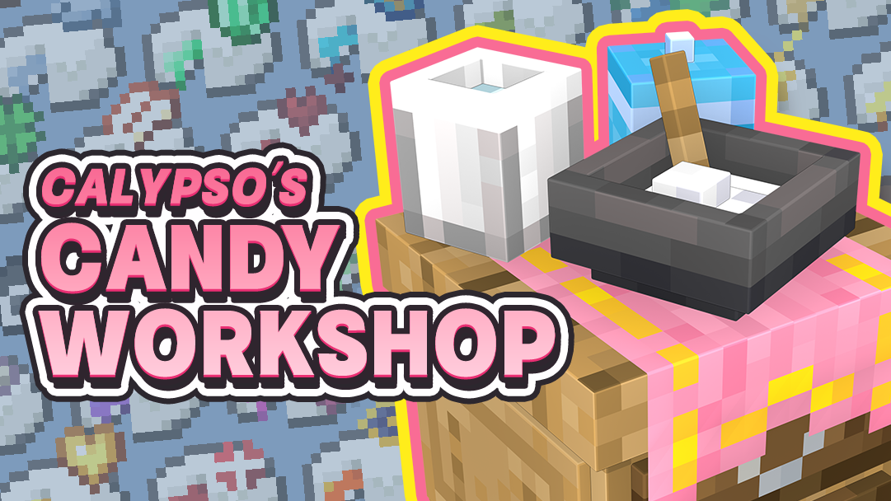
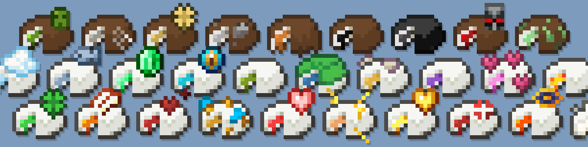
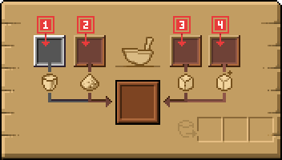
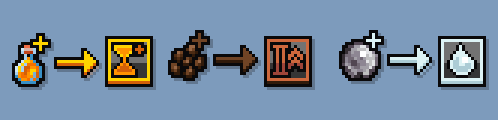
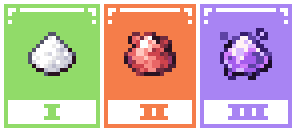
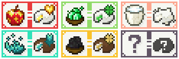

CCW Content Introduction

Calypso's Candy Workshop is a lightweight utility mod that lets you craft various gummies with potion effects in a simple and immersive way.

Whether you're living a peaceful farm life or embarking into thrilling adventures, bring a pack of gummy along to add a little joy and hope to your journey.

_Calypso's Candy Workshop doesn't generate any world content, so you can safely add it to your game at any time._

《卡里普索的糖果工坊》是一个轻量级的实用模组，通过简单且具有沉浸感的方式制作各种带有药水效果的软糖。

无论是养老的田园生活还是惊险刺激的冒险旅途，带上一包糖果上路，带上更多的快乐和希望上路。

_*糖果工坊不会在世界上生成任何东西，这意味着您可以在您的游戏期间随时加入这个模组_

# Candy Workshop 糖果工坊

## Gummy 糖果

_What makes gummies better than vanilla potions?_  

**Stackable:** Stack up to 64 gummies — no more inventory or chest clutter.

**Quick consumption/no residue:** Eat them instantly, with no leftovers.  

**Intuitive visuals:** Each gummy has a unique, easily recognizable icon.

**Stacking duration:** Identical effects stack in duration instead of resetting!

相较于原版的药水，糖果们具有哪些优势？

**可以堆叠：** 堆叠上限为64，不必再担心占用背包或是箱子。

**食用迅速/无残留：** 以极快的速度吃下它们，并且不会留下垃圾。

**直观的外观：** 每个糖果都有独一无二，易于辨认的图标

**食用时间可以堆叠：** 是的，当你食用糖果后，相同效果的时间会被叠加而非刷新！

## Crafting Gummies 制造糖果

1.Milk: Used for blending the ingredients.
2.Sugar: Basic crafting material. Some advanced gummies require Nether Sugar or Dragon’s Breath Sugar ( Ender Sugar ).
3.Main Ingredient: Determines the primary effect of the gummy.
3.Secondary Ingredient: Adds bonus effects — Bold, Excited, or Milky?  
**Once your ingredients are ready, just wait for the process to finish. One cycle produces 8 gummies.*  
**Click the bowl icon in the center to pause the crafting process.*

1.牛奶：放入牛奶来调和
2.糖：放入糖来进行合成，某些高级的软糖需要下界糖粉和龙息糖粉的参与粉
3.主料：决定软糖会对食用者提供何种效果。
4.辅料：决定软糖的额外效果，浓郁、兴奋抑或是奶香？
**当原料备齐之后，您只需要耐心等待即可完成合成，一个合成周期获得8颗软糖。*
**点击中间的碗图标来暂停合成*

## Adding Secondary Ingredients 为糖果添加辅料

Adding honey, cocoa beans, and milk gelatin as secondary ingredients will give extra effects to that batch of candies:  
**Bold:** The gummy's effect will last longer
**Excited:** The gummy provides a stronger effect  
**Milky:** Clears other effects after consumption

在辅料中添加蜂蜜、可可豆和牛奶凝胶，将会为该批次的糖果添加额外效果：
**浓郁：** 该软糖的效果将持续更久
**兴奋：** 该软糖带来更强力的效果
**奶香：** 食用后清除其他效果

## Advanced Gummies 高级糖果

For balance purposes, some gummies require more advanced sugar as raw materials.  
**Nether Sugar Powder: ** Crafted with nether wart and sugar
**Dragon's Breath Sugar Powder: **Crafted with dragon's breath and sugar

出于平衡考虑，部分软糖的合成需要更高级的糖作为原材料。
**下界糖粉：** 使用下界疣和糖进行合成
**龙息糖粉：** 使用龙息和糖进行合成

## 独家配方 Exclusive Recipes

The mod includes special secondary materials to ensure each gummy has a unique recipe that matches its effect.

模组中加入了一些特殊的次级材料，
确保每一种糖果都有对应其效果的合成配方

# Other Functional Content 其他功能性内容
## Milk Extractor & Carton Milk 取奶器&牛奶盒

### Milk Extractor 取奶器
Tired of milk buckets filling your inventory? Use the Milk Extractor and Carton Milk to solve this problem.  
Right-click a cow with the extractor to gather packaged milk.  
Restore the extractor’s durability with paper.  
**Extraction is gentle and harmless to cows.*

还在担心背包被牛奶桶占满？取奶器和牛奶盒将解决这个问题
只需要使用取奶器右键牛牛，该工具将以极其温和的形式快速的获取封装好的牛奶
使用纸张可以为其恢复耐久度。
**提取的量恰到好处，温和不伤牛*

### Carton Milk 牛奶盒
Holds less than a bucket, but it’s perfect for crafting, and convenient to carry and store.
Drinking it removes one status effect.
Eco-friendly packaging means no byproducts when crafting or drinking.

大大少于一桶的容量但是又满足于合成需求，方便携带，方便存储。
喝下它只会移除一个状态效果。
由于采用可降解材料进行罐装，合成或是饮用不会产生副产物。

### Gummy Gift Box (In Development) 糖果礼盒(开发中)
A small gummy package that combines carrying and quick consumption features, currently under development.

集携带与快速食用一体的小小糖果包裹，目前正在开发中

## Developer List 开发人员名单
**Producer & Art|制作人&美术:** [Yuri'sCat Calypso](https://space.bilibili.com/1704421)  
**Main Program Development|主要开发:** Loci_Natit
**Special thanks to my friends|特别鸣谢:**  
**Animation Exchange|动画顾问:** akio
**Partial Texture Support|部分贴图支援:** 【:】

If you find any bugs, please report them here↓
如有BUG请在此处发布↓
[https://github.com/LNatit/CandyWorkshop/issues](https://github.com/LNatit/CandyWorkshop/issues)

## Terms of Use 使用条款
**Code Section:** Unless otherwise stated, open-sourced under the MIT license
**Assets Section:** ARR All Rights Reserved

**代码部分：** 除非另有声明否则以MIT协议开源
**资源部分：** ARR保留所有权利
